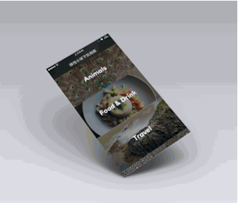

# KYJellyPullToRefresh
实现弹性物理效果的下拉刷新





##How To Use

Firstly,in your ViewController or TableViewController,initiate the Jellview and the "displayLink"  in the `- (void)scrollViewDidScroll:(UIScrollView *)scrollView`  method:
Like this:
```
- (void)scrollViewDidScroll:(UIScrollView *)scrollView
{
    
    if (self.displayLink == nil && (-scrollView.contentOffset.y - 64.5) > 0) {
        self.jellyView = [[JellyView alloc]initWithFrame:CGRectMake(0, -jellyHeaderHeight , [UIScreen mainScreen].bounds.size.width, jellyHeaderHeight)];
        self.jellyView.backgroundColor = [UIColor clearColor];
        [self.view insertSubview:self.jellyView aboveSubview:self.tableView];
        
        
        self.displayLink = [CADisplayLink displayLinkWithTarget:self selector:@selector(displayLinkAction:)];
        [self.displayLink addToRunLoop:[NSRunLoop mainRunLoop] forMode:NSRunLoopCommonModes];
    }

}
```

Then you should change the controlPoint of the Bezier Path
```
-(void)scrollViewDidEndDragging:(UIScrollView *)scrollView willDecelerate:(BOOL)decelerate{

    CGFloat offset = -scrollView.contentOffset.y - 64.5;
    if (offset >= 130) {
        
        self.jellyView.isLoading = YES;
        
        
        [UIView animateWithDuration:0.3 delay:0.0f usingSpringWithDamping:0.4f initialSpringVelocity:0.0f options:UIViewAnimationOptionCurveEaseInOut animations:^{
            
            self.jellyView.controlPoint.center = CGPointMake(self.jellyView.userFrame.size.width / 2, jellyHeaderHeight);
            NSLog(@"self.jellyView.controlPoint.center:%@",NSStringFromCGPoint(self.jellyView.controlPoint.center));
            
            self.tableView.contentInset = UIEdgeInsetsMake(130+64.5, 0, 0, 0);
        } completion:^(BOOL finished) {
            [self performSelector:@selector(backToTop) withObject:nil afterDelay:2.0f];
        }];
    }
    
}

```

Lastest,remove everything:
```
//动画结束，删除一切
-(void)scrollViewDidEndDecelerating:(UIScrollView *)scrollView{

    if (self.jellyView.isLoading == NO) {
        [self.jellyView removeFromSuperview];
        self.jellyView = nil;
        [self.displayLink invalidate];
        self.displayLink = nil;
    }

}

```


Intro:  [http://kittenyang.com/cadisplaylinkanduibezierpath/](http://kittenyang.com/cadisplaylinkanduibezierpath/)


